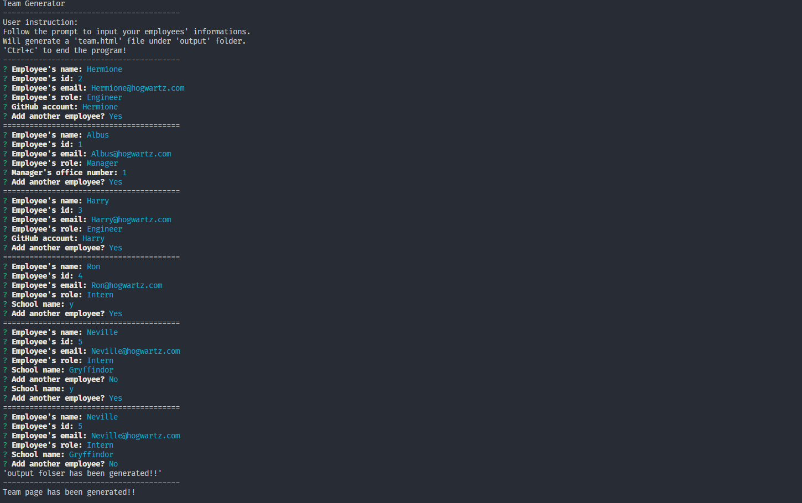
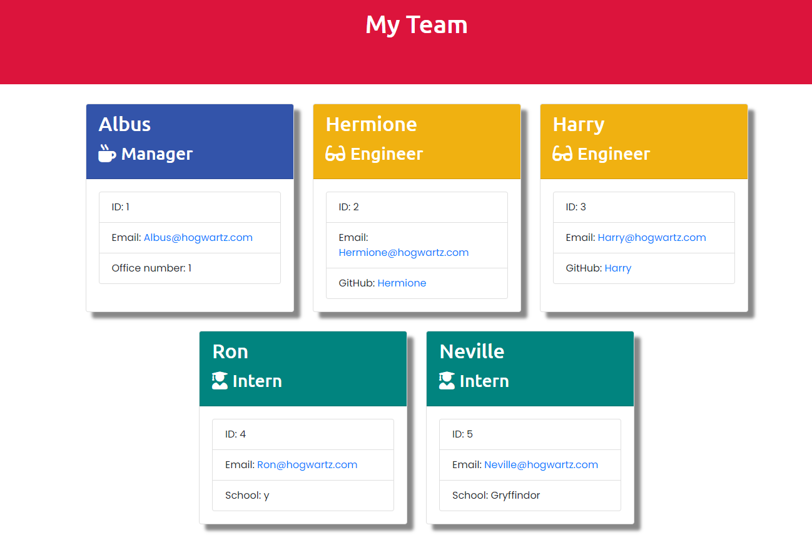

# Good README Generator

## Project description
    This application can generate a Team Page.
    This team page will diplay some general team members' informations base on user's input.
    Each member will displayed with different color by their role.

Video link:
https://drive.google.com/file/d/1g3ZXnZRrwnFvEn-8CQPoIlK-r490hOJe/view

## Table of Contents
* [Installation](#installation)
* [Usage](#usage)
* [Contributing](#contributing)
* [Tests](#tests-information)

## Installation
    1.Download and install node.js.
    2.Download this app.
    3.Under this app forlder, use `npm install` command to install all required node modules

## Usage
    Go to develop forlder and open Command Prompt 
    Type `node app.js` command to start this app.

## Contributing
    Any one is welcome to  contribute this app, expect to hear some good idears from you.

## Tests information
    Testing.. Testing... Testing.....

## Author information
  GitHub: https://github.com/GrandBearSleepy

  Email-address: Hengquan.Li@outlook.com

